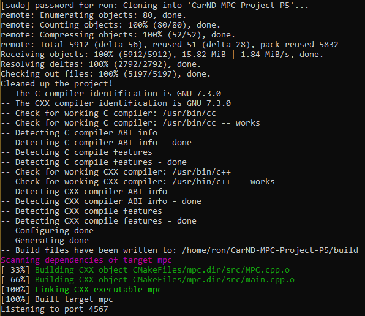

Project 5, Term 2: MPC Controller
=======================

Final Result
------------

The Model Predictive Control project involved writing a C++ program that drives a simulated car around a virtual track using waypoints. The simulated car's actuators have a 100ms latency (delay) that must be considered by the MPC.

My c++ skills continue to improve, but this project was particularly difficult. Since I'm still far from an expert, I used Michael Virgo's project as a reference for tying lessons 18 and 19 together.

Compiling
---------

#### Code must compile without errors using cmake and make.

The code compiles without errors; however it generates numerous warnings. To correct this issue, CMakeLists.txt was modified as follows:

| From:                                | To:                                     |
|--------------------------------------|-----------------------------------------|
| set(CMAKE_CXX_FLAGS "\${CXX_FLAGS}") | set(CMAKE_CXX_FLAGS "\${CXX_FLAGS} -w") |

After the above modification, the [cmake] and [make] output looks good:

Implementation
--------

#### The Model

**Describe the model in detail, including state, actuators and update equations.**

-------------------

The MPC model receives the following information from the simulator:
- ptsx (x-position of track waypoints in global coordinates)
- ptsy (y-position of track waypoints in global coordinates)
- px (current x-position of the vehicle in global coordinates)
- py (current y-position of the vehicle in global coordinates)
- psi (current orientation angle of the vehicle)
- vt (current velocity of the vehicle)
- deltat (current steering angle of the wheels)
- at (current throttle setting)

From this, the following current state calculations are made:
- x (distance from current x-position to each waypoint's x position) = ptsx - px
- y (distance from current y-position to each waypoint's y position) = ptsy - py
- ptsx_vehicle (ptsx waypoints in vehicle's coordinates) = x * cos(-psi) - y * sin(-psi)
- ptsy_vehicle (ptsy waypoints in vehicle's coordinates) = x * sin(-psi) + y * cos(-psi)
- coeffs (3rd degree polynomial of the vehicles waypoint coordinates) = polyfit(ptsx_vehicle, ptsy_vehicle, 3)
- ctet (current cross track error) = polyeval(coeffs, 0)
- epsit (current psi error) = -atan(coeffs[1])
- dt (elased duration) = 0.1
- Lf (distance between the vehicle's center of gravity and it's front axle) = 2.67

Next, the state predictions are made using the following update equations:
- pxt+1 = xt  + vt * cos(psit) * dt = vt * dt;
- pyt+1 = yt + vt * sin(psit) * dt = 0.0
- psit+1 = psit + vt / Lf * -deltat * dt = vt * -deltat / Lf * dt
- vt+1 = vt + at * dt
- ctet+1 = ctet + vt * sin(epsit) * dt
- epsit+1 = epsit + vt * -deltat / Lf * dt;

The MPC Model is then loaded and run.  The purpose of the model is to determine the values for each actuator that minimize the total weighted error:
- state (predicted state vector) is set to pxt+1, pyt+1, psit+1, vt+1, ctet+1, epsit+1
- mpc.Solve(state, coeffs) runs the model

Cost weighting, which determines the relative importance of each equation within the model, is performed within MPC.cpp.  These values are set by trial and error:
- cte cost weight = 2000
- epsi cost weight = 2000
- v cost weight = 1
- delta cost weight = 10;
- a cost weight = 10
- delta change cost weight*  = 500
- a change cost weight* = 10

The model also sets limits on the actuators:
- steering limits are set to +/- 25 degrees
- throttle limits are set to +/- 1

Actuators (vars) are returned from the model

The actuators are set:
- steer_value (steering actuator) = vars[0]
- throttle_value (throttle actuator) = vars[1]

*change cost weights are used to make the ride smoother

---------------
#### Timestep Length and Elapsed Duration (N & dt)

**Discuss the reasoning behind the chosen N (timestep length) and dt (elapsed duration between timesteps) values. Additionally, describe the previous values tried.**

The values for N and dt, 10 and 0.1 respectively, were chosen by selecting the predominant N and dt values from other MPC projects. 

Intuitively, an elapsed duration equal to the actuators' 100ms latency also made sense, as did a timestep of 10, since that produced a one second look-ahead.

To confirm the validity of these settings, timesteps of N = 5, 10, 15 and 20 were tried, as were elapsed durations of dt = .05, .1, .15 and .2.  The best combination tested was N = 10 and dt = .1.

---------------
#### Polynomial Fitting and MPC Preprocessing

The coeffs variable (described above) is the output of the third degree polynomial fitting function.

The x, y, ptsx and ptsy variables (also described above) represent the processing performed prior to polynomial fitting.

---------------
#### Model Predictive Control with Latency

**Provide details on how the Predictive Control model handles a 100 millisecond latency.**

The state predictions above (pxt+1, pyt+1, psit+1, vt+1, ctet+1, and epsit+1) all factor in a latency (dt) of .1.  Although this variable (dt) has the same name as the elapsed duration variable, the latency (dt) is defined in main.cpp, whereas the elapsed duration (dt) is defined in MPC.cpp.

This was done to keep the formulas consistent with those in lessons 18 and 19.

-------------------

Simulation
-------------------

**The vehicle must successfully drive a lap around the track.**

A recording of the vehicle is shown at the top of this page.

No tire leaves the drivable portion of the track surface. The vehicle does not pop up onto ledges and does not roll over any surfaces that would otherwise be considered unsafe (if humans were in the vehicle).  The vehicle does not go over the curb, but occasionally drives on the lines before the curb.

The vehicle achieves speeds in excess of 100 mph.

